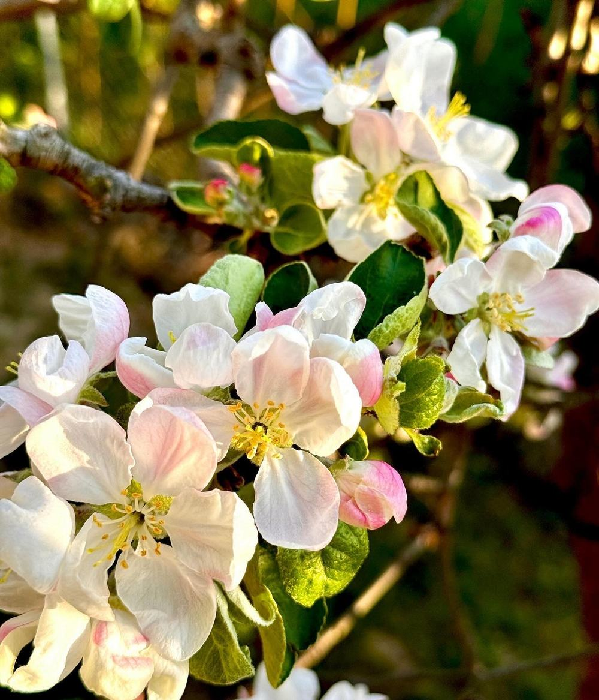

# Makowski Sad: the shared story

This is the content contract for every version in `versions/`. Facts, copy, photos and alt texts come from here, in this order. A version may reword headings and captions in its own style, but it adds no facts. Photos stay real: frame, crop, mask, grade or animate them, but never replace them.

The copy is Polish and keeps the wording of the basic site (`index.html`, `ecology.html`). Typos and punctuation are fixed (see the end of this file). Light follows the seasons: spring, then summer, then autumn, then market days.

## Using the photos

- From a version folder, a photo is `../shared/photos/<file>-<width>.jpg`. Each table row lists the widths that exist. Nothing is upscaled, so photos from small originals have one width only, or a top width below 2000.
- Use `srcset` with width descriptors, give `width` and `height` from the "Size" column (every width of a photo has the same aspect ratio), and add `loading="lazy"` below the fold.
- On phones, keep `sizes` a little under the rendered width so that 3× screens still pick the 1000 px file.
- Every file is sRGB, and all metadata (EXIF, GPS, colour profiles) has been removed.
- The logo stays in the basic site: `../../assets/icons/horizontal_color.svg`, `vertical_color.svg`, `vertical_black.svg`, `vertical_white.svg`. Alt text: „Makowski Sad”.

```html

```

## Brand, contact and links

- Name: Makowski Sad. Words on the logo and the boxes: „Soki naturalne”.
- Brand green: `#2c5e2e`.
- Address: ul. Sosnowa 7, 34-220 Maków Podhalański
- E-mail: info@makowskisad.pl (`mailto:info@makowskisad.pl`)
- Instagram: @makowskisad (`https://instagram.com/makowskisad`)
- Facebook: @makowskisad (`https://facebook.com/makowskisad`)
- Heading above the social links: „Znajdź nas na socialach”
- Footer line: „© 2026 HorizonCrafts.”
- Every version links to the basic site (`../../index.html`, „Strona główna”) and to the list of versions (`../index.html`, „Wszystkie wersje”).

## Page-level copy

- Title of the basic site: „Makowski Sad – Soki Naturalne”
- Description: Naturalne, tłoczone soki jabłkowe z rodzinnego, ekologicznego sadu w Makowie Podhalańskim.
- Main heading: Naturalne soki z Makowskiego Sadu
- Lead: Odkryj wyjątkowe walory tłoczonych soków jabłkowych z ekologicznego sadu w Małopolsce.
- Motto of the ecology page: Najlepsze soki powstają w harmonii z naturą.

## 0 · Miejsce (opening: the place)

Anchor `miejsce`. Light: spring.

Heading on the basic site: **Tradycja i pasja**

Jesteśmy niewielkim, rodzinnym przedsięwzięciem z urokliwego Makowa Podhalańskiego. Zajmujemy się tworzeniem naturalnych soków jabłkowych, z pasją oraz troską o środowisko.

Z dala od ruchliwych dróg w sadzie znajduje się nasz dom.

| File | Widths | Size | Alt | Original in `assets/images/` |
|---|---|---|---|---|
| `0-miejsce-jablon-przed-domem` | 1000, 2000 | 1000×1333 | Kwitnąca jabłoń przed naszym domem w sadzie | `impressions/IMG_0040.JPG` |
| `0-miejsce-sciezka-do-domu` | 1000, 2000 | 1000×1333 | Ścieżka w trawie prowadząca obok kwitnącej jabłoni do domu | `impressions/IMG_0066.JPG` |
| `0-miejsce-korona-nad-domem` | 1000, 1440 | 1000×674 | Biała od kwiatów korona jabłoni na tle nieba, w dole nasz dom | `impressions/51844767-06B6-48C0-A2D6-C74BBAC069EC.jpg` |
| `0-miejsce-hamak-pod-drzewami` | 1000, 1440 | 1000×1167 | Pasiasty hamak pod plandeką wśród drzew, obok gliniana donica | `impressions/8EA38253-5271-4F4C-A253-A6AF1550846C.jpg` |
| `0-miejsce-hamak-w-sloncu` | 1000, 1440 | 1000×1160 | Hamak pod plandeką w promieniach słońca, w tle dolina | `impressions/CE719B37-AF83-4B62-B424-CB09D5B1FC68.jpg` |
| `0-miejsce-hamak-na-zboczu` | 1000, 2000 | 1000×684 | Hamak na trawiastym zboczu, w tle dachy i wzgórza | `impressions/IMG_0024.JPG` |
| `0-miejsce-taras-ze-stolem` | 1000, 2000 | 1000×750 | Drewniany taras z nakrytym stołem wśród kwitnących jabłoni, w oddali wzgórza | `impressions/IMG_1102.jpeg` |
| `0-miejsce-jablon-przy-tarasie` | 1000, 2000 | 1000×750 | Kwitnąca jabłoń tuż przy drewnianym tarasie | `impressions/IMG_1106.jpeg` |
| `0-miejsce-widok-z-balkonu` | 1000, 2000 | 1000×750 | Kwitnąca jabłoń widziana z drewnianego balkonu, w oddali wzgórza | `impressions/IMG_1114.jpeg` |

## 1 · Kwiat (flower)

Anchor `kwiat`. Light: spring.

Nasze kilkudziesięcioletnie jabłonie rosną w naturalny sposób bez przyspieszaczy wzrostu i są organicznie odporne.

Mieszkając pośród drzew, nie chcemy obcować ze środkami chemicznymi służącymi do usprawniania uprawy – stosujemy permakulturę.

Jabłonie przycinamy jesienią, usuwamy pasożyty, wszystko ręcznie.

| File | Widths | Size | Alt | Original in `assets/images/` |
|---|---|---|---|---|
| `1-kwiat-kwiaty-zblizenie` | 1000, 1440 | 1000×1167 | Białoróżowe kwiaty jabłoni z żółtymi pręcikami z bliska | `impressions/75DA9C9A-0476-4AC0-AECB-FD0E0E791D78.jpg` |
| `1-kwiat-kisc-kwiatow` | 1000, 2000 | 1000×1316 | Kiść kwiatów jabłoni wśród młodych liści | `impressions/IMG_0016.JPG` |
| `1-kwiat-kwiat-i-paki` | 1000, 2000 | 1000×712 | Kwiat jabłoni i różowe pąki na gałęzi | `impressions/IMG_0008.jpeg` |
| `1-kwiat-rozowe-paki` | 1000, 2000 | 1000×1333 | Różowe pąki jabłoni tuż przed rozkwitnięciem | `impressions/IMG_0044.JPG` |
| `1-kwiat-slonce-w-koronie` | 1000, 2000 | 1000×671 | Słońce prześwitujące przez kwitnącą koronę jabłoni | `impressions/IMG_2364_jpg.jpg` |

**Clip:** `1-kwiat-kwitnaca-jablon-film.mp4` is H.264, 1920×1080, 4.7 s and 9.3 MB, with no sound track. It was repackaged from `impressions/IMG_0070.MOV` without re-encoding. Its poster is `1-kwiat-kwitnaca-jablon-film-1000.jpg` (1000×562). Description: Kwitnąca jabłoń w sadzie pod pochmurnym niebem. Play it muted and give it a pause control. Don't autoplay it under reduced motion, and load it only when needed (`preload="none"`), because it is the heaviest file here.

## 2 · Jabłko (apple)

Anchor `jablko`. Light: summer, turning to early autumn as the apples redden.

Nasz sad to mikroekosystem, gdzie każde drzewo i owad ma swoją rolę. Nie chcemy tego zaburzać, stosując „chemię”.

Dbamy o różnorodność sadu, tworząc środowisko, w którym różni goście są mile widziani.

Nie stosujemy oprysków, środków ochronnych ani sztucznych nawozów.

The guests on the ecology page are a lizard, chicks in a nest and a spotted flycatcher chick (the last three rows). `IMG_1550` is not in the plan's chapter table. It is here because the anime day names it.

| File | Widths | Size | Alt | Original in `assets/images/` |
|---|---|---|---|---|
| `2-jablko-zawiazek` | 1000, 2000 | 1000×1030 | Maleńki zawiązek jabłka wśród liści | `impressions/IMG_0384.JPG` |
| `2-jablko-zielone-w-smugach-slonca` | 1000, 2000 | 1000×1333 | Zielone jabłko na gałęzi, w tle sad w smugach słońca | `impressions/IMG_1542.jpeg` |
| `2-jablko-zielone-na-galazce` | 1000, 2000 | 1000×1333 | Zielone jabłka na gałązce, w dole trawa w pasach światła i cienia | `impressions/IMG_1544.jpeg` |
| `2-jablko-zielone-wsrod-lisci` | 1000, 2000 | 1000×1247 | Zielone jabłka ukryte wśród liści | `impressions/IMG_1596.jpeg` |
| `2-jablko-kisc-pod-slonce` | 1000, 2000 | 1000×1205 | Kiść jasnozielonych jabłek pod słońce | `impressions/IMG_0511.JPG` |
| `2-jablko-slonce-w-lisciach` | 1000, 2000 | 1000×1333 | Słońce przebijające się przez liście jabłoni z zielonymi owocami, w dole drewniane schody | `impressions/IMG_1550.jpeg` |
| `2-jablko-czerwone-na-drzewie` | 1000, 2000 | 1000×750 | Jabłoń obsypana czerwonymi jabłkami w promieniach słońca | `impressions/IMG_0082.jpeg` |
| `2-jablko-czerwone-pod-slonce` | 1000, 2000 | 1000×750 | Czerwone jabłka na gałęzi pod słońce | `impressions/IMG_0084.jpeg` |
| `2-jablko-w-dloni` | 1000, 2000 | 1000×1333 | Czerwone jabłko w dłoni | `impressions/IMG_1788.jpeg` |
| `2-jablko-jaszczurka` | 1000 | 1000×751 | Jaszczurka na ziemi wśród liści | `Animals/IMG_0004.jpg` |
| `2-jablko-piskleta-w-gniezdzie` | 888 | 888×1024 | Pisklęta w gnieździe uwitym z traw | `Animals/IMG_1601.jpg` |
| `2-jablko-piskle-mucholowki` | 1000 | 1000×921 | Pisklę muchołówki szarej z szeroko otwartym dziobem | `Animals/IMG_1630.jpg` |

## 3 · Zbiór (harvesting)

Anchor `zbior`. Light: late summer into autumn.

Starannie zbieramy i selekcjonujemy jabłka, tylko najlepsze trafiają do naszych soków.

| File | Widths | Size | Alt | Original in `assets/images/` |
|---|---|---|---|---|
| `3-zbior-zrywanie-z-drzewa` | 1000, 2000 | 1000×1484 | Zrywanie jabłek prosto z drzewa | `IMG_1154.jpg` |
| `3-zbior-siatki-w-sadzie` | 1000, 2000 | 1000×1333 | Jasna płachta i zielone siatki rozłożone na trawie pod jabłoniami | `impressions/IMG_1689.jpeg` |
| `3-zbior-siatki-pod-jabloniami` | 1000, 2000 | 1000×750 | Zielone siatki rozłożone pod jabłoniami | `impressions/IMG_1751.jpeg` |
| `3-zbior-siatka-przed-domem` | 1000, 2000 | 1000×750 | Zielona siatka na trawie w sadzie, w tle dom | `impressions/IMG_1780.jpeg` |
| `3-zbior-siatka-pod-jablonia` | 1000, 2000 | 1000×879 | Zielona siatka rozpięta nisko pod jabłonią | `appleProcessing/IMG_1687.jpeg` |
| `3-zbior-jablka-na-siatce` | 1000, 2000 | 1000×1334 | Jabłka leżące na zielonej siatce pod drzewami | `appleProcessing/IMG_1750.jpeg` |
| `3-zbior-jesienna-jablon` | 1000, 2000 | 1000×775 | Jesienna jabłoń z owocami w promieniach słońca | `impressions/IMG_0081.jpeg` |
| `3-zbior-jesienny-sad` | 1000, 2000 | 1000×1203 | Jesienny sad z siatkami rozłożonymi pod drzewami | `impressions/IMG_0080.jpeg` |
| `3-zbior-skrzynki-jablek` | 1000, 2000 | 1000×1308 | Drewniane skrzynki pełne czerwonych jabłek na trawie | `appleProcessing/IMG_0836.jpeg` |
| `3-zbior-pojemnik-na-jablka` | 1000, 2000 | 1000×1599 | Zielony pojemnik na jabłka zawieszony na metalowym stojaku | `impressions/IMG_1695.jpeg` |

## 4 · Transport (transportation)

Anchor `transport`. Light: autumn.

Wyselekcjonowane jabłka transportujemy do „Tłoczni Choczni” pod Wadowicami.

Heading on the ecology page: **Współpracujemy z lokalnymi biznesami**

- **Stadnina koni.** Nadmiarowe jabłka zawozimy dla koników pana Andrzeja. Link „Jazda konna”: `http://www.makowskagora.pl`
- **Leśnicy i myśliwi.** Nasze jabłka też idealnie nadają się do karmienia zwierząt leśnych. Dzikie zwierzątka zostają w lesie i nie wchodzą w szkodę :)

Pozostałe odpady oddajemy do lokalnego Punktu Selektywnej Zbiórki Odpadów Komunalnych.

Only two real photos exist for this step. There is none of the drive itself, so illustrate the way from the orchard to „Tłocznia Chocznia” near Wadowice in the version's style. Don't add places, distances or times.

| File | Widths | Size | Alt | Original in `assets/images/` |
|---|---|---|---|---|
| `4-transport-bagaznik-pelen-workow` | 1000, 2000 | 1000×750 | Bagażnik samochodu pełen worków z jabłkami | `impressions/IMG_1745.jpeg` |
| `4-transport-koniki` | 1000 | 1000×760 | Dwa konie na pastwisku, w tle zalesione wzgórza i słońce | `Animals/IMG_1069.jpg` |

## 5 · Tłoczenie (pressing)

Anchor `tloczenie`. Light: autumn.

„Tłocznia Chocznia” to profesjonalna tłocznia, wyposażona w nowoczesne urządzenia, które zapewniają precyzję, skuteczność procesu tłoczenia i dbałość o środowisko naturalne.

Cały proces jest zoptymalizowany przez tłocznię.

From the juice-quality block of the basic site:

- 100% naturalne składniki
- Bez dodatku cukru i konserwantów

There is one real photo, and none of the press machinery or of juice flowing. Illustrate the process in the version's style. The copy says the equipment is modern, so don't draw an old wooden press as if it were the one used.

| File | Widths | Size | Alt | Original in `assets/images/` |
|---|---|---|---|---|
| `5-tloczenie-worki-w-tloczni` | 1000, 2000 | 1000×1411 | Worki z jabłkami w tłoczni, obok waga | `impressions/IMG_1748.jpeg` |

## 6 · Pakowanie (packaging)

Anchor `pakowanie`. Light: autumn, indoors.

Heading on the basic site: **Soki jabłkowe**, with the subheading „W pudełku lub same worki 3 l.”

- Przydatność do spożycia przez co najmniej 5 dni po otwarciu
- Mniej materiałów na opakowanie
- Łatwe przechowywanie i nalewanie

Soki są dystrybuowane w workach PET z kranikiem.

Opcjonalnie soki są dodatkowo opakowane w prosty karton, umożliwiający łatwe nalewanie oraz zabezpieczający bukłak przed przypadkowym uszkodzeniem.

Etykiety robimy własnoręcznie, wycinając z kartonów po pizzy lub zużytych pudeł. Przywiązujemy je najprostszym sznurkiem.

Wszystkie napisy i logo są umieszczane poprzez ostemplowanie – w ten sposób nie tworzymy dodatkowych etykiet, nie używamy naklejek. W ten sposób kartony mogą być wielokrotnie używane – wystarczy uzupełniać „wkład”, do czego gorąco zachęcamy.

How to recycle each part:

Etykietki można utylizować jako papier, podobnie jak samo pudełko, jak się już zużyje. Worek PET, po całkowitym opróżnieniu, można wyrzucić do plastików. Zalecamy odciąć wcześniej kranik – umożliwia to wykorzystanie całości soku i ułatwia sortowanie.

| File | Widths | Size | Alt | Original in `assets/images/` |
|---|---|---|---|---|
| `6-pakowanie-worki-z-zawieszkami` | 1000, 2000 | 1000×782 | Worki soku z kranikami i ręcznie wyciętymi zawieszkami na sznurku | `impressions/IMG_1804.jpeg` |
| `6-pakowanie-stempel-i-etykiety` | 1000, 2000 | 1000×1333 | Stempel z logo, ręcznie wycięte kartonowe etykiety i szpulka sznurka | `impressions/IMG_1760.jpeg` |
| `6-pakowanie-etykiety-na-sznurku` | 480 | 480×640 | Ostemplowane etykiety z kartonu przywiązane sznurkiem | `IMG_1759Medium.jpeg` |
| `6-pakowanie-karton-i-worek` | 1000, 2000 | 1000×750 | Kartony z ostemplowanym logo i worki soku z kranikami na stole pod jabłonią | `impressions/IMG_1819.jpeg` |
| `6-pakowanie-kartony-na-jabloni` | 1000, 2000 | 1000×1333 | Dwa kartony soku ustawione w rozwidleniu jabłoni | `impressions/IMG_1838.jpeg` |
| `6-pakowanie-polki-z-sokami` | 1000, 2000 | 1000×750 | Drewniane półki pełne worków soku z zawieszkami | `impressions/IMG_1958.jpeg` |
| `6-pakowanie-karton-wizualizacja` (`.png`) | 279 | 279×365 | Karton soku jabłkowego Makowski Sad | `karton_wizualizacja_1 1.png` |

The carton is a render, not a photo. It is a PNG with a transparent background and only 279 px wide: `6-pakowanie-karton-wizualizacja-279.png`.

## 7 · Sprzedaż (selling)

Anchor `sprzedaz`. Light: market days.

Produkujemy rocznie około 300 litrów wysokiej jakości soków jabłkowych.

Chętnie obsługujemy imprezy lokalne.

Close with the contact block from "Brand, contact and links".

| File | Widths | Size | Alt | Original in `assets/images/` |
|---|---|---|---|---|
| `7-sprzedaz-stoisko-pod-namiotem` | 1000, 2000 | 1000×1333 | Stoisko z sokami pod białym namiotem, za stołem dwie osoby | `impressions/IMG_2331.jpeg` |
| `7-sprzedaz-drewniane-stoisko` | 1000, 2000 | 1000×748 | Drewniane stoisko z sokami | `IMG_0548.jpg` |
| `7-sprzedaz-impreza-ludowa` | 914 | 914×1024 | Karton z logo i worek soku, w tle występ zespołu w strojach ludowych | `IMG_0549.jpg` |
| `7-sprzedaz-stol-w-sadzie` | 1000, 2000 | 1000×1333 | Biały drewniany stół w sadzie z kartonami soku | `impressions/IMG_1850.jpeg` |

## Changes from the basic site

- Typos fixed: transpotrujemy → transportujemy, rónorodność → różnorodność, kazde → każde, „Nadmiarowe jabłkowe” → „Nadmiarowe jabłka”, and the missing Polish letters in zużytych, umożliwiający, używane, można, już, zużyje, wyrzucić, umożliwia and całości.
- Polish quotation marks („…”), spaced en dashes, commas before -ąc phrases and full stops at the ends of sentences. „W Pudełku lub same worki 3L.” became „W pudełku lub same worki 3 l.”
- The sentence „Nie chcemy tego zaburzać stosując "chemię", stosujemy permakulturę.” was split so that permaculture stays with the flower and the micro-ecosystem with the apple. „Ta profesjonalna tłocznia…” names the press, so the pressing chapter stands on its own.
- The alt text „Pisklaki” became „Pisklęta”.

In Polish typesetting, keep a non-breaking space after one-letter words (a, i, o, u, w, z) and between a number and its unit (5 dni, 3 l, 300 litrów).
